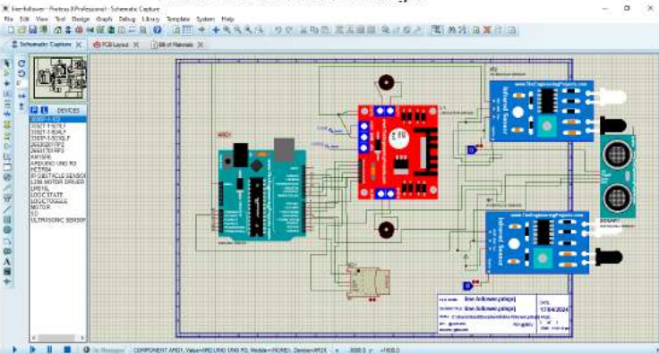
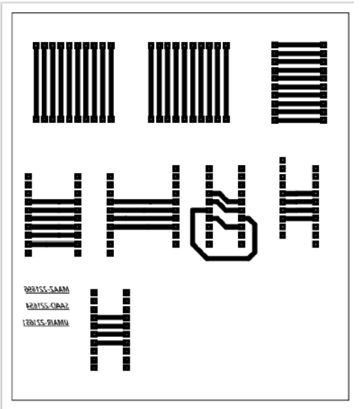

# 🤖 Intelligent Line Follower Robot with ESP32 Wireless Communication

An Arduino-based autonomous mobile robot capable of **line following**, **obstacle avoidance**, and **color detection** using multiple sensors. The project integrates embedded systems, robotics, and control algorithms to create a versatile autonomous navigation platform developed as a Mechatronics Engineering semester project.

---

## 📌 Features

- 🚗 High-precision line following using IR sensors
- 🚧 Real-time obstacle detection and avoidance using HC-SR04 ultrasonic sensor
- 🎨 Color recognition using TCS3200 Color Sensor
- ⚙️ Differential motor control with L298N Motor Driver
- 🔄 Encoder-based motor feedback
- 📡 ESP32 support for wireless communication
- 🔋 Efficient battery-powered operation
- 🖥️ Proteus simulation before hardware implementation
- 📈 Modular design for future enhancements

---

## 🛠 Hardware Components

| Component | Purpose |
|----------|---------|
| Arduino Uno | Main Controller |
| ESP32 | Wireless Communication |
| IR Sensor Array | Line Detection |
| HC-SR04 Ultrasonic Sensor | Obstacle Detection |
| TCS3200 Color Sensor | Color Recognition |
| L298N Motor Driver | Motor Control |
| DC Motors | Robot Locomotion |
| Encoder Modules | Speed & Position Feedback |
| Robot Chassis | Mechanical Platform |
| Rechargeable Battery | Power Supply |

The system combines sensing, control, and embedded processing to perform autonomous navigation tasks. :contentReference[oaicite:1]{index=1}

---

## ⚙️ System Overview




---

## 🧠 Working Principle

1. The IR sensor array continuously detects the black line.
2. The controller adjusts motor speeds to keep the robot centered.
3. The ultrasonic sensor monitors the path for obstacles.
4. If an obstacle is detected, the robot executes an avoidance maneuver.
5. The color sensor identifies predefined colors for task execution.
6. Encoder feedback improves movement accuracy and control.

---

## 📂 Project Structure

```
Line-Follower-Robot/
│
├── Arduino_Code/
│   ├── LineFollower.ino
│   ├── MotorControl.cpp
│   ├── Sensors.cpp
│
├── Proteus/
│   ├── Simulation.pdsprj
│
├── PCB/
│   ├── PCB_Design.pdf
│
├── Images/
│
├── Documentation/
│   ├── Project_Report.pdf
│
└── README.md
```

---

## 🚀 Technologies Used

- Arduino IDE
- Embedded C/C++
- Proteus
- PCB Design
- Embedded Systems
- Robotics
- Motor Control
- Sensor Fusion

---

## 🔄 Control Algorithm

```
Start
   │
   ▼
Initialize Sensors
   │
   ▼
Read IR Sensors
   │
   ├── Line Detected?
   │       │
   │       ├── Yes → Follow Line
   │       │
   │       └── No → Search Line
   │
Read Ultrasonic Sensor
   │
Obstacle?
   │
   ├── Yes → Avoid Obstacle
   │
   └── No
        │
Read Color Sensor
        │
Perform Required Action
        │
Repeat
```

---

## 📊 Applications

- Autonomous mobile robots
- Warehouse automation
- Industrial material handling
- Educational robotics
- Embedded systems learning
- Smart navigation research

---

## 📈 Future Improvements

- PID-based line following
- Computer Vision (OpenCV)
- SLAM implementation
- Path planning algorithms
- Bluetooth/Wi-Fi mobile application
- Camera-based navigation
- AI-based object detection

---

## 👨‍💻 Team Members

- **M. Maaz** (221696)
- **Umair Mubashir** (221651)
- **Saad Bin Owais** (221654)

**Supervisor:** Sir Umer Farooq

Department of Mechatronics Engineering

Air University, Islamabad :contentReference[oaicite:2]{index=2}

---

## 📄 Project Report

The complete project documentation, including system design, hardware selection, software implementation, PCB design, testing, and conclusions, is available in the project report. :contentReference[oaicite:3]{index=3}

---

## 📜 License

This project is developed for educational purposes as part of the Bachelor of Mechatronics Engineering curriculum.

---

## ⭐ Support

If you found this project helpful, consider giving the repository a ⭐ to support our work.
